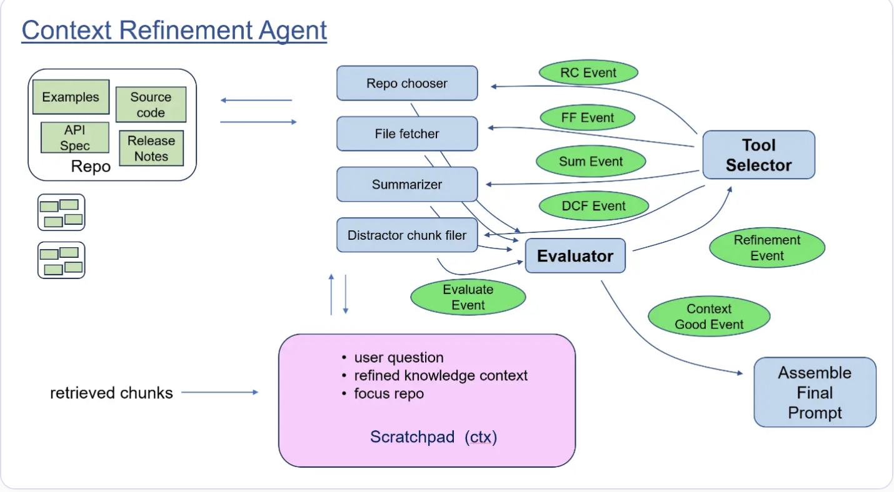
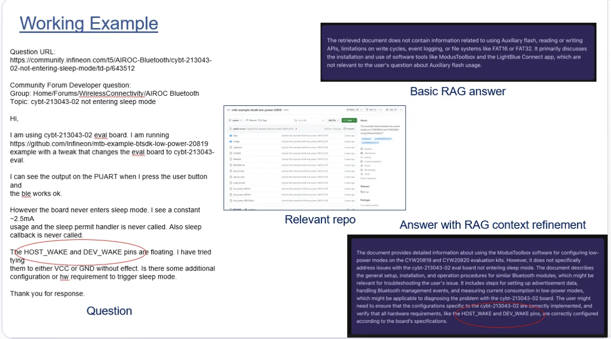
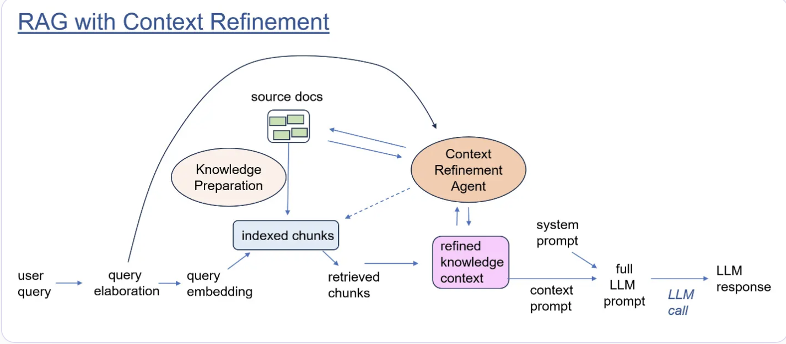

# 🤖 Agentic RAG for Code Repositories

> 🏆 Winner of the Global 500 Investor Award

> 📚 Originally featured on [LlamaIndex Blog](https://www.llamaindex.ai/blog/rag-context-refinement-agent) and [Devpost](https://devpost.com)

An intelligent system that enhances RAG (Retrieval Augmented Generation) capabilities for code repositories through an agent-based architecture.

## 🎯 Overview

This project addresses the challenges of applying RAG to code repositories in technical support scenarios. Instead of relying on traditional RAG approaches, we implement an agent-based architecture that intelligently processes and refines context to generate more accurate and meaningful responses.

## ❗ Problem Statement

Traditional RAG systems face limitations when dealing with code repositories:
- Code chunks often lack necessary context for effective indexing
- Direct code snippets may not provide sufficient context for LLM response synthesis
- Standard RAG approaches struggle with technical documentation spread across multiple repositories

## 🛠️ Methodology

The solution implements a multi-step agent architecture:

1. **📝 Scratchpad System**
   - Maintains question-specific context information
   - Starts with initial retrieval chunks from RAG vector store
   - Iteratively refines context through agent interactions

2. **🔍 Evaluator Component**
   - Assesses if current context is sufficient for answering queries
   - Determines need for additional context refinement
   - Triggers appropriate refinement tools when needed

3. **🧠 Context Refinement Agent**
   Employs various tools including:
   - Repo relevance scoring and filtering
   - File and directory summarization
   - Complete code file inclusion when necessary
   - Irrelevant chunk removal
   - Documentation linking and integration
   - External resource integration

4. **⚡ Tool Selector**
   - Intelligently chooses appropriate refinement tools
   - Can operate based on:
     - Predetermined sequences
     - Rule-based policies
     - Dynamic decision-making

## ✨ Key Features

- Smart context preparation for RAG
- Dynamic context refinement
- Intelligent tool selection
- Integration with multiple knowledge sources
- Support for technical documentation and code repositories

## 💪 Benefits

- Enhanced context understanding
- More accurate responses to technical queries
- Better handling of code-related questions
- Improved technical support efficiency
- Flexible and extensible architecture

## 🎯 Example Use Case

The example below demonstrates how the agentic RAG improves response quality compared to baseline RAG:
This example is from an Infineon community forum post. Infineon has over 1000 code repositories.

### Question Context
A user inquires about microcontroller sleep states and wake signals.

### Process Flow

1. **Initial RAG Response** (Score: 0.3)
   - Basic chunks retrieved
   - Limited context about sleep states
   - Insufficient information for a complete answer

2. **Context Refinement Applied**
   - Evaluator determines initial context is insufficient
   - Tool Selector identifies relevant file
   - Complete file context added to scratchpad

3. **Improved Response** (Score: 0.7)
   - Comprehensive information about:
     - HOST_WAKE signals
     - DEV_WAKE functionality
     - Sleep state management
     - Related wake mechanisms

[Image placeholder: Context refinement flow diagram]

This example showcases how the agentic RAG architecture significantly improves context quality through intelligent refinement, leading to more complete and accurate responses.

